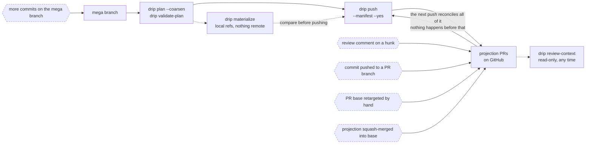

# drip

A tool for drip-feeding a mega branch back into main as thin, reviewable PRs. Slices are derived projections of the mega branch, not maintained branches — regenerated, never rebased.

**Status:** M0 (feasibility spike) built. M1 (real CLI, `drip plan`/`drip verify`) built. M2 (`drip push`, real PRs via `gh`) built. M3 (content-addressed skip, squash-merge reconciliation, interdiff comments) built. M4 (comment anchoring, conservative exact-hash-only cut) built. M5's deterministic half (build-check caching, parallel per-slice builds) built. M5's AI half re-scoped away from a bundled provider to `plan --json` and an MCP server (`drip mcp`) for external tools (`docs/adr/0009`). Correctness is checked mechanically on every run and covered by 206 tests. **The M0 kill-gate blind-boundary scoring against real branches has not been run yet** — see `BUILD-PLAN.md` for what that means and why everything downstream is contingent on it. It is now a command rather than an afternoon of reading (`drip score`), and `docs/validation.md` records what has actually been measured and what drip may therefore claim. See `CONTEXT.md` for the domain model, `docs/review-unit-workflow.md` for how a mega branch becomes a reviewable PR set, `docs/review-feedback-loop.md` for what happens to that PR set afterwards (comments, pushes to PR branches, squash-merges — what drip reconciles and what it doesn't), `docs/pr-stacks.md` for the GitHub stacks integration end to end (what drip creates, what it owns, and which commands stay GitHub's), and `docs/adr/` for the architecture decisions.

## CLI

```bash
bun install
bun src/cli.ts <command> --help    # every command's flags, with the values each accepts
```

| Command | What it does |
|---|---|
| `plan <branch>\|--worktree` | partition into an atomic slice DAG |
| `verify <branch>\|--worktree` | tree-hash invariant + per-slice build check |
| `push <branch>` | materialize slices as branches and open a PR for each |
| `validate-plan <branch>\|--worktree` | check a semantic projection manifest against the plan |
| `materialize <branch>\|--worktree` | write each projection to a local ref, and stop there |
| `review-context <branch>` | a projection's PR, drift and open threads (read-only) |
| `stack status\|link <branch>` | how drip's PRs chain, and grouping them into a GitHub stack |
| `score <branch>\|--worktree --expected path` | measure drip's boundaries against a hand-drawn partition |
| `override add\|list\|remove` | boundary decisions that survive replanning |
| `manifest adopt\|discover\|list\|forget` | bind projections to PRs that already exist |
| `mcp` | MCP stdio server exposing plan/verify/override as tools |

Flags are declared per command, so `--help` is generated rather than maintained and a flag belonging to another command is an error rather than silently ignored (`docs/adr/0029-cli-framework.md`). What follows is what each command is *for*; `--help` is the reference for its flags.

- **`plan`** — diffs `<branch>` against its merge-base with `--base` (default `main`), clusters hunks into slices via a tree-sitter symbol-edge graph (TypeScript/JavaScript only), prints the slice DAG. `--assign-ids` injects Gerrit-format `Change-Id` trailers into any commit missing one (opt-in, rewrites the branch in place, prints the old→new SHA mapping — never automatic). `--json` prints only a machine-readable plan (slices, files, symbols, edges, unmatched override selectors) — no other output — for an external tool to read ambiguous-boundary/naming context and write decisions back through `drip override add`. See BUILD-PLAN.md §9: the AI belongs upstream of the tool, not inside it — there's no `--ai` flag or bundled provider integration here on purpose.
  Hunks tree-sitter can't map to an enclosing symbol don't go into one catch-all bucket: each gets a deterministic per-file **fallback group** (`<path>::(file)`, or `<dir>/package.json::(deps)` for a manifest and its lockfile) with the reason it's unassigned, and those selectors work with `override add` like any symbol — see `docs/adr/0015-fallback-grouping.md`.
- **`--worktree`** — plans the **working tree** instead of committed history: staged, unstaged and untracked changes, on top of whatever the branch has already committed. The point is to partition a change *before* the commits that would make it reviewable exist, since the partition is what tells you what to commit. drip builds a real tree object from the working tree in a scratch index — your index and working tree are never touched — and everything downstream runs unchanged against it, so `verify --worktree` proves the slices reconstruct the working tree exactly.

  ```bash
  bun src/cli.ts plan --worktree --base main --target-slices 3 --coarsen --emit-manifest
  ```

  The branch argument becomes optional (the checked-out branch names the plan, and naming a different one is an error, not a relabel). The plan stays base-relative — slicing only the uncommitted delta would produce slices that don't apply on the base. The source is always reported, in text and as a `source` object in `--json`, so a clean worktree says it planned committed history rather than letting you assume otherwise. `push --worktree` and `--assign-ids --worktree` are refused: one opens real PRs from content that exists only in your working tree, the other rewrites commits the work isn't in. `push` doesn't declare the flag at all, so the refusal is a parse error naming it rather than a check several steps in. `verify`, `score`, `validate-plan` and `materialize` all take it — the last two because a manifest is worth validating against work in progress, and because materialize's refs are ordinary objects in your own repository that nothing leaves. A manifest emitted from a worktree plan validates unchanged once the commits exist — its selectors are durable. See `docs/adr/0021-worktree-as-a-diff-source.md`.
- **Excluded sections** — diff sections drip can't turn into hunks (binary files, pure renames, mode-only changes, empty file creations) are reported by path and reason in an `EXCLUDED` block and in `--json`, and named again in any tree-hash failure. They're in the diff and in no slice, so they guarantee that failure on their own; they used to be dropped silently.
- **`--coarsen`** — an optional planning mode above the atomic slice DAG: groups slices into review-sized **candidate projections** using four deterministic rules (a file's top-level hunks join that file's symbol slice; a test joins the production file it exercises; a helper with one consumer is absorbed into it; and, only under `--target-slices n`, same-feature-directory merging until the budget is met). Each projection lists its constituent slices, its external prerequisites, and why each merge happened. `force_split` is never coarsened away — a budget that would need it is reported unmet. See `docs/adr/0017-review-sized-coarsening.md`.
- **`verify`** — runs `plan`, then checks the tree-hash invariant (`apply(slices in topological order) == tree(branch)`) and a per-slice standalone build check. The default command is whatever the repository declares for itself: `bunx tsc --noEmit` if a root `tsconfig.json` exists, else a root `typecheck` script if there is one, else `--build-cmd`. drip never composes a whole-repo command out of package-level pieces — in a workspace with no root check it says so, lists the per-package check scripts it found (ready to paste into a projection's `verification`), and warns that a projection can reconstruct the mega branch's tree and still not compile. See `docs/adr/0023-reviewable-stacks-and-runnable-checks.md`. With `--coarsen`, both checks run against the coarsened projections instead, proving the coarsening still reconstructs the mega-branch tree — and `--emit-manifest` works here too, so a skeleton can be written from projections that have just been verified rather than only planned.
- **`override add|list|remove`** — boundary overrides (`force_merge` / `force_split`, keyed by `file::QualifiedSymbolPath`) persist in `.git/drip.db` and survive replanning:
  ```bash
  bun src/cli.ts override add <branch> --kind force_merge --selector-a file::Symbol --selector-b file::Symbol [--note text] [--repo path]
  bun src/cli.ts override add <branch> --kind force_split --selector-a file::Symbol [--note text] [--repo path]
  bun src/cli.ts override list <branch> [--repo path]
  bun src/cli.ts override remove <id> [--repo path]
  ```
- **`push`** — refuses if `verify` fails. Materializes each slice as a `drip/<branch>/sliceN` branch and opens a PR via `gh` for each one that doesn't already have a correspondence entry (re-running updates the existing branch/PR instead of duplicating it — see `docs/adr/0006-slice-correspondence-key.md`). `--dry-run` previews without touching GitHub; otherwise `--yes` is required, since this and `stack link` are the only commands with real external side effects.
  - `--reclaim` overwrites a **drip-owned** branch that has moved on the remote. drip reads `git ls-remote` once per run and compares each branch against the sha it last wrote there, so a commit someone pushed onto a projection branch blocks that projection instead of being force-pushed away or sitting under an `unchanged` that never looked. The block names both shas and the two ways forward: fold the change into the mega branch and replan, or re-run with `--reclaim`. It never applies to an adopted branch — drip doesn't own that one, and the way back is `manifest adopt`. A drip-owned branch someone *deleted* is simply recreated, since that discards nothing. See `docs/adr/0028-remote-drift-on-owned-branches.md`.
  - `--reviewable-stack` refuses any projection that would need a generated integration base. Under `flat-first` a projection with two prerequisites gets a minted `drip/<branch>/<id>-base` branch that has **no PR**: GitHub merges the child fine, but reviewers can't walk the prerequisites as a stack and a workflow filtered on `pull_request.branches: [main]` never runs on it. Without the flag every such PR is still flagged — in its result line, its note and a summary — because that situation should never be discovered after the fact. Refusal propagates to anything that depended on the refused projection, since its PR would target a branch that was never pushed.
  - **Stacks by default.** The PR chain a push produces is grouped into a **stack on GitHub** — the layered review UI, and `gh stack merge` to land the chain (or a prefix of it) atomically — the same way `gh stack submit` pushes branches, opens PRs and creates the stack in one step. `--no-link-stack` opts out and reports what was left ungrouped. See `drip stack link` below and `docs/adr/0030-github-stacks.md`.
  - `--require-verification` refuses a projection that contains code (`.ts`/`.tsx`/`.js`/…) and declares no `verification` command, **even if it sets `verificationReason`**. A reason records a decision; this flag is for the caller who has decided such decisions can't cover code. Docs- and config-only projections keep the ordinary rule. Also available on `validate-plan` and `materialize`.
  - `--draft` opens drip-owned PRs as drafts. Creation only: an existing PR — drip's own or an adopted one — keeps whatever draft/ready state it has, since marking a PR ready for review is a decision a re-run has no business undoing. `--dry-run` reports the state each PR would be opened with. See `docs/adr/0022-local-materialization-and-draft-prs.md`.
  - `--projection stacked` (default) chains every PR onto the previous slice's branch.
  - `--projection flat-first` picks each base from the DAG instead: independent roots target the base branch, a slice with one prerequisite targets that prerequisite's branch, and a slice with several gets a generated `drip/<branch>/sliceN-base` integration branch (which is the case `--reviewable-stack` above refuses). Nothing is made a review dependency purely by topological ordering — see `docs/adr/0016-flat-first-projection.md`. A slice whose hunks won't apply on its prerequisites alone is reported `blocked` and not pushed (exit 1), never silently dropped.
- **`validate-plan`** — checks a **semantic projection manifest** against the current plan. Coarsening can balance slices; it cannot know that six of them are "the report-tab detail experience". So that boundary is stated explicitly in a JSON manifest, proposed by whatever is upstream (an agent reading `plan --json`, a human, both), and validated deterministically here — never derived, never auto-discovered, never written by drip. See `docs/adr/0018-semantic-projection-manifest.md`.

  ```jsonc
  {
    "version": 1,
    "sourceBranch": "mega-appeals",
    "budgets": { "files": 20, "hunks": 60, "changedLines": 800 },
    "projections": [
      {
        "id": "report-tab-details",
        "title": "feat(appeals): show Report-tab details",
        "intent": "Expose and render report, offence, offender and vehicle detail.",
        // durable group-key selectors, not `slice17` ordinals — those renumber on replan
        "atomicSlices": ["src/appeals/report.ts::renderReport"],
        "glue": ["src/appeals/report.ts::(file)"],
        "dependsOn": ["appeals-dto"],
        "verification": ["bun run typecheck", "bun test src/appeals"]
      }
    ],
    "defer": [{ "slice": "README.md::(file)", "reason": "ships with the release notes" }]
  }
  ```

  **`verification` is executed, not documented.** Each projection's commands run against *its own materialized tree* — the prerequisite closure its PR would show — so a projection that applies cleanly and reconstructs the final tree, but isn't actually runnable because it's missing a fixture, an export or a route registration, fails here rather than in review. A failure blocks `validate-plan` and refuses `push`. Results are cached by the tree they ran against, so independent projections aren't re-checked when something unrelated moves, and captured output is written to `<gitdir>/drip/verification/<branch>/` and reported by path. A projection with no commands warns unless it sets `verificationReason`; `--strict` turns every warning into a failure (useful in CI), and `--no-manifest-check` skips execution entirely for local experimentation. See `docs/adr/0019-executable-verification.md`.

  **Named verification profiles.** A repository usually has two or three real answers to "how do I check this" and every projection repeats one of them. Declare them once in `.drip/verification.json` (or `<gitdir>/drip/verification.json`) and reference one by name:

  ```jsonc
  // .drip/verification.json
  { "version": 1, "profiles": { "typecheck": { "description": "the repo's own typecheck", "commands": ["pnpm typecheck"] } } }
  ```
  ```jsonc
  // a projection
  { "id": "report-tab-details", "verificationProfile": "typecheck", ... }
  ```

  Resolution is a lookup, not a merge: declaring both a profile and inline `verification` commands is an error rather than a silent choice between them, an unknown profile names the file it looked in and the profiles defined there, and a malformed profiles file fails on load even if nothing references it. The resolved commands are what runs, what `--require-verification` counts and what the PR body carries — the only place the indirection shows is the report, which prints the profile next to the commands it produced. drip never picks a profile for you: there is no default and no inference. See `docs/adr/0024-reusable-verification-profiles.md`.

  **`--require-intent`** refuses a projection that states no `intent`. Without the flag that's a warning (an emitted skeleton is meant to be edited), and it says per projection which fields are still yours to write. A projection with no stated intent is a set of slices with an id — which is what coarsening already produces, and the reason the manifest layer exists at all. See `docs/adr/0025-boundary-scoring-and-the-review-unit-workflow.md`.

  **Where it lives.** With no `--manifest`, `validate-plan` looks in `.drip/projections/<branch>.json` (in the working tree, committable — an approved review plan is a document a team argues about and keeps) and then `<gitdir>/drip/projections/<branch>.json` (private to the clone). `drip plan <branch> --coarsen --emit-manifest` writes a valid starting skeleton there — every slice assigned, real selectors filled in — for you or an agent to give real ids, titles and intents; it refuses to overwrite without `--force`. `push` deliberately does **not** auto-discover: a manifest left lying around must never silently change what `push --yes` sends to GitHub, so it says one exists and pushes atomic slices unless you pass `--manifest`.

  Validated: every slice assigned exactly once or explicitly deferred with a reason; nothing deferred that another projection needs; the `dependsOn` graph acyclic; every atomic dependency crossing a boundary declared (widening is fine, dropping is not); each projection actually applies on its declared prerequisites; shared glue reachable from everyone who needs it; budgets respected unless `oversizeReason` says otherwise; and the whole graph still reconstructs the mega-branch tree — deferred slices included, so deferral can't silently lose work. `push --manifest` runs the same validation and refuses on any error; a projection's PR is keyed on its manifest `id`, so replanning underneath it doesn't cost the PR its identity or its review comments.
- **`materialize`** — the same materialization `push` does, stopping at your own repository. Validates the manifest, then writes each projection's commit to a local ref (`drip/<branch>/<id>` — the name `push` would use on the remote) and, with `--output dir`, checks each one out into its own worktree at `dir/<id>`. It prints each projection's id, ref, computed base, commit sha, changed files and apply/widening status. **No remote ref is written, no PR is opened, closed or commented on, and no correspondence is recorded** — so a projection can be compared against a handwritten branch that already has reviewers on it, and the scope conflict resolved, before anything is adopted or force-pushed.

  ```bash
  bun src/cli.ts materialize appeals --only report-tab-details --output ../projections
  git diff drip/appeals/report-tab-details..tims-630-port-report-tab-sections
  ```

  `--only id[,id]` (repeatable) materializes a subset. It never narrows what a projection is built on: the selection's prerequisite closure is written alongside it and reported as `(prerequisite)`, since a projection quietly rebased onto the base branch would be previewing something other than what `push` would send. In stacked mode that closure is the whole prefix.

  `--projection` defaults to **`flat-first`** here, unlike `push`: a manifest's `dependsOn` graph *is* the flat-first base selection, and it's what `validate-plan` and `manifest adopt` already materialize. Re-running is a no-op — a ref already at the projection's tree is left alone (`commit-tree` mints a fresh sha every run, so sameness is judged by tree), and a ref holding *different* content is reported `blocked` and not moved until `--force`. A projection bound to an adopted PR still materializes to drip's own ref and reports the binding, so the two can be diffed rather than one silently overwriting the other. See `docs/adr/0022-local-materialization-and-draft-prs.md`.
- **`manifest adopt|list|forget`** — binds a semantic projection to a PR that **already exists**, instead of opening a drip-owned one. Teams usually don't start from a mega branch: a few good, small, handwritten PRs exist first — with reviewers, comments and branch names people link to — and only later does an integration branch expose their combined dependency graph. Without adoption, `push --manifest` sees no correspondence for them and opens a parallel `drip/<branch>/<id>` set beside them.

  ```bash
  bun src/cli.ts manifest adopt appeals --projection report-tab-details --pr 373 --head tims-630-port-report-tab-sections --yes
  ```

  Projection id, PR number and head branch are all required and cross-checked — adoption on two out of three would be a heuristic, and a wrong guess here becomes a future force-push over someone else's branch. The binding is recorded only if the branch's **effective diff**, replayed onto the mega branch's merge base, produces exactly the tree the projection materializes (itself plus its declared prerequisite closure). Anything else is refused with an interdiff; a branch carrying its own change but cut from the base branch rather than from its prerequisites is called out by name, since that reads identically to "wrong PR" in a raw diff and means something quite different.

  Adoption never touches the remote — no push, no retarget, no comment. Afterwards, `push --manifest --projection flat-first` updates that PR through the normal correspondence path (interdiff comment, comment anchoring, squash-merge detection), and a *dependent's* base names the adopted branch rather than a drip-owned one. Three things change because drip doesn't own an adopted branch: it force-pushes **with a lease** (a reviewer's commit pushed in between blocks the push instead of vanishing), it skips whenever the branch already shows the projection's tree rather than on a content-hash match, and it **never retargets** the PR — a base that disagrees with the manifest graph is reported on every push, and changing it means changing it on the PR and re-running `manifest adopt`. `manifest list` shows every projection PR and whether drip opened it or adopted it; `manifest forget` drops a mis-binding without touching the PR. See `docs/adr/0020-adopting-existing-prs.md`.
- **`manifest discover`** — which open PRs *are* the projections in your manifest, and the exact command to adopt each one. Read-only: it lists open PRs, fetches each head, replays its effective diff onto the mega branch's merge base and compares the tree with what each unbound projection materializes. A candidate is a tree match and nothing else — no title similarity, no branch-name matching, no authorship. The commonest near miss (a branch carrying a projection's own change but cut from the base branch rather than from its prerequisites) is named as such rather than reported as "no candidate", two PRs carrying the same tree are both offered with the ambiguity stated, and drip's own branches and already-bound heads are skipped.

  ```bash
  bun src/cli.ts manifest discover appeals
  #   report-tab-details <- #373 tims-630-port-report-tab-sections — port report tab [exact tree match]
  #       drip manifest adopt appeals --projection report-tab-details --pr 373 --head tims-630-port-report-tab-sections --yes
  ```

  Nothing is recorded, pushed or commented on; adoption stays an explicit `--yes` that re-checks all three of projection, PR and head branch. See `docs/adr/0026-guided-adoption-discovery.md`.
- **`review-context`** — the state of a projection's review surface, joined from the three places it lives: what the manifest says the projection is, what the store says it corresponds to (branch, PR, adopted or drip-opened, recorded base vs the base the manifest graph implies now), whether its content has moved since its PR last received it (with the changed files and selectors), the open review threads on it plus any comments drip previously couldn't relocate, and which layer of which GitHub stack its PR sits in.

  Read-only by construction — no comment, no reply, no resolve, no push, no correspondence write; the suite asserts every mutating GitHub call is never made and that neither the refs nor the store change across a run. An unreachable `gh` is reported as unavailable with the local half of the answer intact, `--no-review` skips the GitHub read entirely, and a recorded commit this clone doesn't have is reported as *unknown* rather than guessed at. Thread resolution state isn't exposed by the endpoint drip reads, and the report says so instead of implying it. See `docs/adr/0027-read-only-review-context.md`.
- **`stack status` / `stack link`** — GitHub shipped stacked pull requests in July 2026, and a stack is exactly what `drip push --projection stacked` has always emitted: an ordered chain of PRs, each based on the head branch of the one below it. What was missing was the grouping object that makes GitHub show the layers and lets `gh stack merge` land the chain in one all-or-nothing operation.

  ```bash
  bun src/cli.ts stack status appeals            # how drip's PRs chain, and what GitHub has grouped
  bun src/cli.ts stack link appeals --dry-run    # the chains, without reading or writing GitHub
  bun src/cli.ts stack link appeals --yes        # create/extend the stack
  ```

  **GitHub's convention first.** When the `gh stack` extension is installed, drip groups its PRs by running `gh stack link` — GitHub's own command for exactly this case, branches owned by another tool with no local tracking written. Without the extension drip calls the endpoints `link` itself calls, so an install drip can't make on your behalf never decides whether a push can finish; the report says which path ran. Three details keep delegating safe: PR *numbers* are passed rather than branch names (a branch argument would make `link` push it and open a PR — that's `drip push`'s job), `--base` is the chain's real bottom base (which makes `link`'s retarget path a no-op, since drip derives the chain *from* the bases), and an adopted member's live base is read first, because that's the one case where `link` would retarget a PR whose base is someone else's decision (`docs/adr/0020`).

  The rest of the extension stays out of it: `rebase`, `sync` and `modify` manage branches and track them in `.git/gh-stack`, which is the opposite of how drip treats a projection branch (derived, regenerated, never rebased). drip writes no `.git/gh-stack`, so none of them act on its branches by accident — and when you *want* local navigation, `gh stack checkout <n>` is the way GitHub intends you to get it. drip prints that command, along with `gh stack merge <n> --yes`, and runs neither.

  **A GitHub stack is strictly linear, and drip's projection graph is a DAG.** `--projection stacked` maps exactly — one chain, one stack, by construction. `flat-first` generally doesn't, and each way it can't is reported rather than resolved: a **fan-out** (two projections on the same prerequisite) links the chain up to the fork and names both dependents, because which one continues the stack is a review decision no graph settles; independent **roots** each become their own stack, which is what they are; and a projection sitting on a generated integration base starts a new chain, since that branch has no PR — the same defect `--reviewable-stack` refuses, seen from GitHub's side. The chain relation is the base each PR *actually targets*, not the slice DAG, so a chain drip reports is one GitHub will accept.

  Linking is additive and never restructures on its own: `created`, `extended` (a stack holding a prefix gets the missing top layers), `unchanged`, or `diverged` — which writes nothing. What `diverged` offers next depends on **ownership**: drip records the stacks it creates (`stack_ownership` in `.git/drip.db` — provenance, not a copy of membership, which is read live), so a diverged stack drip made can be dissolved and rebuilt from the mega branch with `--reclaim`, exactly as that flag already force-pushes a drip-owned branch that moved, while a stack drip didn't make is never dissolved with or without the flag. The mega branch is the source of truth; everything downstream is derived from it and rebuildable from it. Merged members are excluded from the comparison, so a second lap doesn't report a conflict that isn't one, and open PRs above drip's chain are left alone and reported rather than claimed. The whole integration is written up in `docs/pr-stacks.md`. `stack status` is read-only and computes what `link` *would* do with the same function `link` uses, so the preview can't drift from the act; a repository without the preview enabled 404s, says so, and changes nothing else. drip prints `gh stack merge <n> --yes` and never runs it.
- **`score`** — measures drip's boundaries against a partition you drew by hand. This is the M0 kill gate from `BUILD-PLAN.md` ("are the proposed boundaries ones you'd have drawn? if under two-thirds are, stop") as a command rather than an impression, and the same instrument one layer up for review candidates.

  ```jsonc
  // hand-drawn.json — kept wherever the branch it describes lives, never in this repo
  { "version": 1, "units": [{ "id": "auth-refactor", "selectors": ["src/auth.ts::login", "src/auth.ts::logout"] }] }
  ```
  ```bash
  bun src/cli.ts score appeals --expected hand-drawn.json --layer atomic       # the kill gate
  bun src/cli.ts score appeals --expected hand-drawn.json --layer candidates   # --coarsen's output
  bun src/cli.ts score appeals --expected hand-drawn.json --layer manifest     # the semantic projections
  ```

  Hand-drawn units are matched to drip units one-to-one (greatest overlap first, ties broken deterministically), so a split costs the smaller fragments and a merge costs one of the two units — a plurality match would score "drip merged two features into one PR" as a perfect result for both, which is the exact failure the gate exists to catch. Every disagreement is reported by selector, fallback groups are excluded unless `--include-fallback`, selectors that no longer exist are reported rather than dropped, and a partition that matches nothing fails rather than scoring 0/0 as a pass. `--threshold` moves the line; the default is two-thirds. Exit code 1 below it. See `docs/adr/0025-boundary-scoring-and-the-review-unit-workflow.md`, `docs/review-unit-workflow.md` and `docs/validation.md`.
- **`mcp`** — starts an MCP stdio server exposing `drip_plan`, `drip_verify`, `drip_validate_plan`, `drip_review_context`, `drip_stack_status`, `drip_override_list`, `drip_override_add`, `drip_override_remove` as tools, so an MCP client (an agent, an editor integration) can read plan/verify data and write override decisions without shelling out to the CLI. `drip_plan`/`drip_verify` take `worktree` too, so an agent can propose a partition from work in progress before any git state changes. `drip_review_context` is the read-only view of a projection's PR, branch, drift and open threads (docs/adr/0027), and `drip_stack_status` the read-only view of how those PRs chain and what GitHub has grouped into a stack (docs/adr/0030) — there is no `drip_stack_link`, since creating a stack is a real side effect on someone's review surface — there is no write counterpart, for the same reason there is no `push` or `manifest adopt` tool: one has real side effects and the other decides that drip may later force-push over a branch it doesn't own, and both need `--yes` from a human. No AI provider inside drip anywhere — see `docs/adr/0009-ai-integration-external-not-bundled.md`.

## The loop after the first push

Splitting a mega branch is the easy half. The PRs then sit in front of people who comment on them, push to them, merge them and retarget them, while you keep committing to the mega branch underneath. Everything drip does about that happens on the **next `drip push`** — there is no daemon, no webhook and no background process.



The dashed hexagons are the external inputs. In short:

| External input | What the next `drip push` does |
|---|---|
| Review comment on a hunk | Exact hunk-hash match → left alone. No match → a threaded reply saying the code moved and couldn't be confidently relocated. |
| Commit pushed to a **drip-opened** branch | Refused: drip reads the remote once per run and blocks rather than silently discarding it or ignoring it. `--reclaim` overwrites deliberately (`docs/adr/0028`). |
| Commit pushed to an **adopted** branch | Same refusal, with no `--reclaim` — drip doesn't own that branch. Re-run `manifest adopt` after reviewing the commits. |
| Projection squash-merged into base | Detected by reverse-apply, dropped from the stack, PR closed, later projections re-based past it. |
| PR base retargeted by hand | drip-opened → retargeted back to what the manifest implies. Adopted → reported every run, never changed. |
| More commits on the mega branch | Replan. A manifest projection keeps its PR (correspondence is keyed on the manifest `id`); an atomic slice keeps its PR only while its symbol composition is stable. |

`docs/review-feedback-loop.md` has the annotated version: which ADR governs each behaviour, the drip-owned vs adopted ownership rule that explains most of them, and the loop's known blind spots.

## M0 spike

`m0.ts` is the original throwaway single-file spike this was built from — kept as-is, superseded by `src/`.

### Try it

[drip-dummy](https://github.com/fustilio/drip-dummy) is a fixture repo for exercising the tool: `main` is the base, `feature` is a mega branch with a shared helper called from two routes plus unrelated noise, `feature2` stress-tests hoisted def-use ordering.

```bash
git clone https://github.com/fustilio/drip-dummy dummy-repo
cd dummy-repo && git checkout feature && cd ..  # branches other than the clone's default aren't checked out locally yet
bun src/cli.ts verify feature --repo dummy-repo
```

## Tests

```bash
bun test
```

206 tests across 15 files. They run against real git in disposable temp repos (`src/test-helpers.ts`), not a fake `GitBackend` — see `docs/adr/0010-test-against-real-git.md` for why. Everything else runs real git plumbing, including a real `git push` to a local bare repo standing in for a remote, and — in the adoption suite — real handcrafted branches on that remote for drip to compare against.

The one real external boundary, GitHub's API (`src/github.ts`), is mocked via `bun:test`'s `mock.module`. Those mocks go through `githubMock()` in `test-helpers.ts`, which supplies the **whole** export surface: bun's module mocks are global to the test process, so a partial one leaves module evaluation order deciding whether an unrelated file's `import { ghX } from "./github"` resolves at all.

`src/cli.test.ts` runs the real CLI as a subprocess against a temp repo, covering per-command flag scoping, the kebab-case surface, every parser, the required-input refusals and the error format (`docs/adr/0029`).
