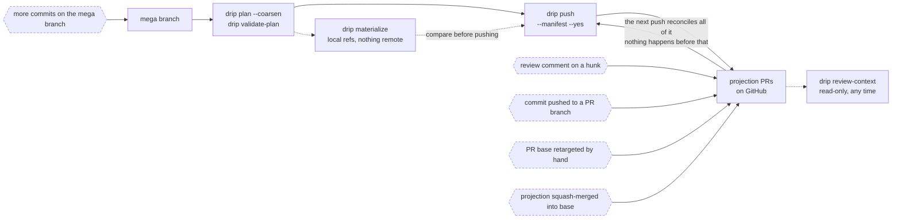

# The review feedback loop

`docs/review-unit-workflow.md` describes a one-way path: a mega branch becomes a
validated review plan becomes a set of PRs. That path is only the first lap.
Once PRs exist, things start happening to them that drip did not do — a reviewer
comments on a hunk, someone pushes a commit to a branch, a projection gets
squash-merged, a base gets retargeted, and you keep working on the mega branch
underneath all of it.

This document is the other half: what arrives from outside, what drip does about
it, and what it deliberately doesn't.

## The loop



The dashed hexagons are the external inputs. Everything else is drip, and every
response to one of them happens on the **next `drip push`** — drip has no
daemon, no webhook and no background process, so between two pushes the PRs and
drip's idea of them drift freely. `drip review-context` is the one way to see
that drift without changing anything.

## What drip does with each input

| External input | What drip does | When | Where it's reported |
|---|---|---|---|
| **Review comment on a hunk** | Re-derives the slice's hunks and looks for an exact hash match. Still there → left alone. Gone → a threaded reply on the original comment saying the code moved and couldn't be confidently relocated. | Next push, and only if that projection's content actually changed | The reply on the thread; `review-context` lists comments drip previously failed to relocate |
| **Commit pushed to a branch drip opened** | Refused. drip reads the remote once per run, sees the branch isn't at the sha it last wrote, and blocks rather than choosing silently between discarding the commit and ignoring it. `--reclaim` overwrites deliberately. | Next push | `blocked`, naming both shas and the two ways forward |
| **Commit pushed to an *adopted* branch** | Same refusal, and no `--reclaim`: drip doesn't own the branch. The projection is `blocked` and everything depending on it is refused too. | Next push | `blocked` with the recorded sha and "review them, then re-run `drip manifest adopt`" |
| **PR branch deleted from the remote** | drip-opened → recreated from the projection, reported in the note. Adopted → `blocked`; drip won't recreate a branch it never made. | Next push | The note, or `blocked` |
| **Projection squash-merged into base** | Reverse-applies the projection's patch against the base tip; if it applies clean the content is already on base, so the projection is dropped from the stack and its PR closed with a comment. Later projections re-base past it. | Next push | `squash-merged` status; the closing comment on the PR |
| **PR base retargeted by hand** | On a PR drip opened: retargeted back to what the manifest graph implies. On an adopted PR: reported every run and never changed, because the base is a review decision someone else made. | Next push | The projection's note: "targets X, but the manifest implies Y — drip does not retarget an adopted PR" |
| **More commits on the mega branch** | Replans from scratch. A manifest projection keeps its PR because correspondence is keyed on the manifest `id`; an atomic slice keeps its PR only while its symbol composition is stable. | Next plan/push | `review-context` reports content drift per projection, with the changed files and selectors |
| **Base branch advances independently** | The merge-base moves and everything is recomputed against it. The tree-hash invariant is unaffected. | Next plan | Normal plan output |
| **Content moved under an existing PR** | Posts an interdiff comment (previous force-push → this one), because GitHub renders nothing for a force-push. | Next push | The interdiff comment on the PR |

## Who owns the branch

Almost every row above is a consequence of one distinction:

- A **drip-opened** branch (`drip/<branch>/<id>`) is drip's property. It is
  regenerated rather than rebased — that is what "slices are derived
  projections" means — and retargeted freely.
- An **adopted** branch (`drip manifest adopt`) is someone else's property.
  Skipped on tree equality rather than content hash, and never retargeted
  (docs/adr/0020).

If a branch has reviewers on it and history you care about, adopt it. Don't let
drip open a parallel PR beside it — that's what `drip manifest discover` is for.

What ownership does **not** change is whether drip may discard a commit it
didn't write. Every branch drip has a recorded sha for is checked against the
remote once per run and pushed under a lease, its own branches included, so a
commit someone pushed onto a projection branch blocks the push either way
(docs/adr/0028). The difference is the way out: a drip-owned branch can be
overwritten deliberately with `--reclaim`, an adopted one can only be re-bound
with `manifest adopt`.

> [!TIP]
> A review fix pushed straight onto a projection branch will block the next
> `drip push`, and that is the intended outcome rather than an obstacle. The
> projection is derived from the mega branch: a change that only exists on the
> branch is a change the next replan cannot see. Fold it into the mega branch
> and replan. `--reclaim` is for when you've decided the commit isn't wanted.

## What drip never does on its own

Nothing in this loop runs unattended. Specifically:

- **No polling, no webhooks, no daemon.** Every reconciliation is a side effect
  of a `drip push` you ran.
- **`push` is the only command with remote side effects**, and it requires
  `--yes`. `materialize`, `validate-plan`, `manifest discover` and
  `review-context` write nothing remote at all.
- **`push` does not auto-discover a manifest.** A manifest lying in
  `.drip/projections/` must never silently change what `push --yes` sends;
  it says one exists and pushes atomic slices unless you pass `--manifest`.
- **Adoption is never inferred.** `manifest discover` proposes candidates on
  exact tree match and prints the command; binding still needs projection id,
  PR number and head branch, cross-checked, with `--yes`.
- **No comment is ever resolved, edited or deleted.** Drip replies to a thread
  it can no longer anchor, and that is the whole of its write access to review
  conversation.

## Known blind spots in the loop

Honest limits, so they aren't discovered in a review:

- **Comment reconciliation only runs when a projection's content changed.** A
  comment on a projection that is never touched again is never checked (nothing
  to reconcile), but a comment on a projection that gets squash-merged away is
  never reconciled either — squash-merged projections skip the push path.
- **Only top-level, right-side comments.** Left-side (deleted-line) comments and
  thread replies are skipped rather than reconciled (docs/adr/0007).
- **Relocation is exact-hash-only.** A hunk that moved by one line of context is
  treated as gone. That is deliberate: the alternative is a fuzzy match that
  silently re-anchors a comment to code it was never about.
- **Squash-merge detection can false-negative.** It is a reverse-apply check
  against the base tip, not real content-addressing, so context drift around the
  merged code means "not detected" — the projection just pushes normally. It
  cannot false-positive a projection that wasn't merged.
- **Thread resolution state is invisible.** It lives in GitHub's GraphQL API and
  the REST endpoint drip reads doesn't carry it, so `review-context` reports the
  threads it can see and says `resolutionStateKnown: false` rather than calling
  them unresolved.
- **A base changed on an adopted PR is reported, never absorbed.** Picking it up
  means changing it on the PR and re-running `manifest adopt`.
- **Drift is detected by sha, not by content.** A branch someone pushed to is
  reported as moved even if they pushed exactly what drip was about to; telling
  those apart needs a fetch per branch and doesn't change the answer
  (docs/adr/0028).
- **`--dry-run` can't check drift with an unreachable remote.** It degrades to
  "unknown" and says so per projection rather than previewing a clean run it
  never verified.

## Reading the state at any time

```bash
drip review-context <branch>                      # every projection
drip review-context <branch> --projection <id>    # one
drip review-context <branch> --no-review --json   # local half only, machine-readable
```

For each projection it joins what the manifest says it is, what the store says
it corresponds to (branch, PR, adopted or drip-opened, recorded base vs the base
the manifest graph implies now), whether its content has moved since its PR last
received it and which selectors moved, and the open threads plus any comments
drip previously couldn't relocate.

Read-only is a property of the code rather than a promise: the suite asserts
that no mutating GitHub export is called and that neither the refs nor the store
change across a run (docs/adr/0027).

## See also

- `docs/review-unit-workflow.md` — the forward path this loop closes
- `docs/adr/0007-comment-anchor-scope.md` — why relocation is exact-match-only
- `docs/adr/0016-flat-first-projection.md` — how a projection's base is chosen
- `docs/adr/0020-adopting-existing-prs.md` — the ownership rule in full
- `docs/adr/0027-read-only-review-context.md` — why the read surface is separate
